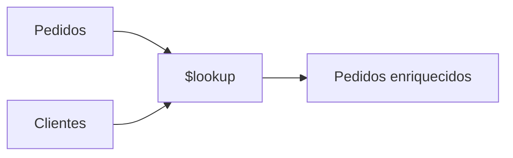

# \$lookup — Join en MongoDB

MongoDB no es relacional, pero permite unir colecciones.

Supongamos:

Colección `clientes`:

```JS
{ _id: 1, nombre: "Ana", ciudad: "Madrid" }
```

Colección `pedidos`:

```JS
{ total: 200, clienteId: 1 }
```

Consulta con `$lookup`:

```JS
db.pedidos.aggregate([
  {
    $lookup: {
      from: "clientes",
      localField: "clienteId",
      foreignField: "_id",
      as: "clienteInfo"
    }
  }
])
```

### Modelo mental del \$lookup



### Consideración arquitectónica importante

Si estamos usando `$lookup` constantemente, puede indicar:

* Diseño demasiado relacional
* Falta de denormalización estratégica

MongoDB favorece modelos donde el documento contenga la información necesaria para evitar joins frecuentes.

