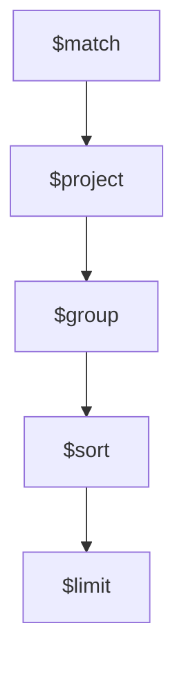

# Orden óptimo del pipeline

Regla práctica profesional:

1. `$match` temprano
2. `$project` para reducir campos innecesarios
3. `$group`
4. `$sort`
5. `$limit`

Visualmente:

Reducir volumen lo antes posible mejora rendimiento.

