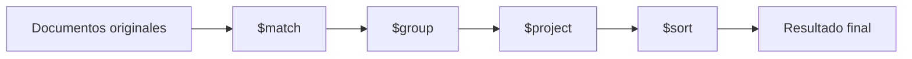

# Modelo mental del Aggregation Framework

El Aggregation Framework funciona como una tubería de procesamiento, conocida como ​**pipeline**​.

Cada etapa:

1. Recibe documentos
2. Los transforma
3. Entrega el resultado a la siguiente etapa

Visualmente:

La clave aquí es comprender que:

* Cada etapa no modifica la colección original
* Cada etapa trabaja sobre el resultado de la anterior
* El orden importa profundamente

Un error común es creer que el orden es intercambiable.
No lo es.

